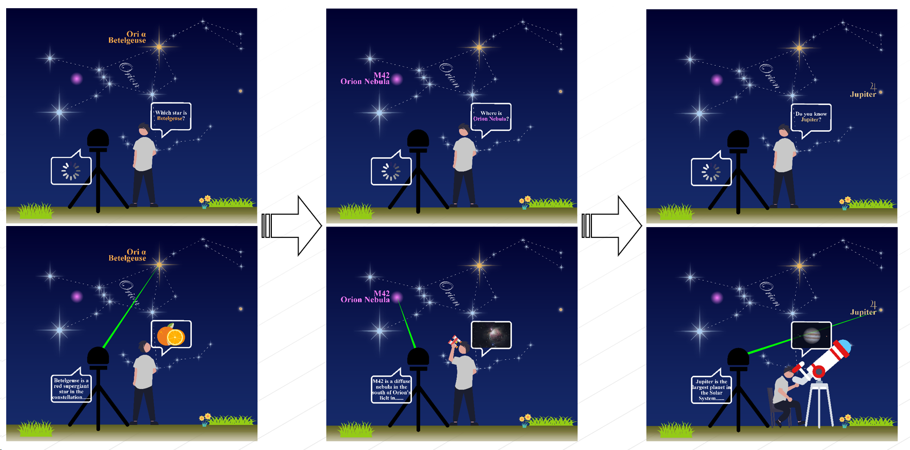

# AstroYingClaw 🌟——基于OpenClaw和智慧天文指星讲解仪的天文教学自动化插件

[](https://opensource.org/licenses/MIT)    [](https://nodejs.org)

##  产品背景

2023年，大模型掀起了一阵人工智能的热潮。

来自东北林业大学天文爱好者协会的几名计算机开发者也不例外。这群开发者在前几年就借助微信小程序的热潮，为解决市面上天文学习小程序的空白，开发了小程序《星云vallige+》，用于天文知识学习，观测适宜度查询，实时数据查询等，总使用人数近万，为广大的天文爱好者提供了诸多便利，也为天文知识的科普普及做出了贡献。该微信小程序也获得   [2019中国高校计算机大赛微信小程序应用开发赛二等奖](https://weixin.qq.com/cgi-bin/newreadtemplate?t=edu_portal/zh-hans/news/detail/59/index)和全国大学生天文创新作品竞赛一等奖。

而随着大模型热潮的到来，他们也知道，或许一种全新的交互模式即将到来。团队成员在2023年研发了一款**智慧天文指星讲解仪**，该设备打破了以往被动天文工具的概念，而是变成可语音主动交互的指星讲解仪器。用户向设备语音提问天文相关问题，设备会识别用户的意图，为用户讲解天文知识，并自动指向对应的星体。该设备定位人群是天文教学组织、天文协会或者用于班级、研学团体、兴趣班的天文学习实践，亦可用于旅游观光区的观星体验。

该设备已经搭建了原型机，并且原型机具备了上述所有的交互功能。


该设备的出现在一定程度上，推动了天文的AI智能化发展，不过，openclaw的出现将这个设备的应用推向了新高度。或许我们也不再满足于一次次的语音交互设备，一些更大的设想也出现在我们的脑海：
- 能否通过openclaw实现一句话生成一节课的教学内容？
- 能否让openclaw自主编排课件，并根据不同人群编写不同难度的课程？
- 能否让生成的教学内容自动执行，即一句话可以实现由openclaw控制讲解仪，使得讲解仪和服务端自主讲解，指星，给人沉浸的学习体验？

或许我们以前还在设想，一句话让讲解仪边指星边讲解，**而openclaw的出现，正在让这一切变成现实……**


## 📖 简介
基于上述需求，开发者本人便开发了一个插件。该插件用于控制智慧天文指星讲解仪器，但与该仪器解耦，用于实现自动化课件的生成，和实时天文数据计算等功能。我们将其起名为**AstroYingClaw**。

AstroYingClaw 是一个功能强大的天文教学自动化插件，专为 OpenClaw 平台设计。通过控制天文指星仪、编排课件、执行自动化教学流水线，让天文教学更加生动有趣。

### ✨ 核心功能

# 天文教学插件功能说明

## 🛠️ 工具列表

| 工具名称 | 功能描述 | 触发方式/示例 |
| :--- | :--- | :--- |
| **astro_celestial_lookup**<br>天体查询 | 查询天体的实时坐标信息（方位角、高度角）。支持中文名称查询，使用 Python ephem 库精确计算天体在指定地点和时间的当前位置。 | "织女星在哪里"<br>"查询天狼星的位置"<br>"北极星的坐标是什么"<br>"Vega 的方位角和高度角" |
| **astro_audio_play**<br>音频播放 | 播放音频文件，支持 MP3、WAV 等格式，可控制音量和播放模式。支持 Windows TTS 语音朗读。 | "播放 intro.mp3"<br>"音量调到 80"<br>"朗读这段文字" |
| **astro_generate_teaching_content**<br>内容生成 | ⚠️ 生成天文教学内容的专用工具。当用户要求"生成"、"介绍"、"讲解"天文相关内容时使用。生成用于 TTS 播放的口语化讲解词，不是 Markdown 文件。 | "生成织女星的介绍"<br>"讲解夏季大三角"<br>"制作天狼星的教学内容"<br>"北京地理位置介绍" |
| **astro_parse_pipeline**<br>流水线解析 | 解析天文教学流水线配置文件，支持 YAML 和 JSON 格式，验证步骤和时长。 | "解析 lesson-01 课程"<br>"验证课程配置"<br>"课程文件是什么" |
| **astro_serial_control**<br>串口控制 | 通过串口控制天文指星仪设备，包括移动到指定天体、控制激光、归位等操作。 | "移动到织女星"<br>"打开激光"<br>"指星仪归位"<br>"指向方位角 45 度" |

## ✨ 核心特性

* **🎯 指星仪控制** - 通过串口自动控制指星仪，指向指定天体
* **🔊 语音朗读** - 使用 TTS 自动朗读课程内容
* **📋 天文教学课件生成** - 使用 YAML 配置教学流程
* **📺 课件展示** - 自动展示教学内容，支持预生成文本
* **🚀 自动化执行** - 按时间线自动执行所有教学步骤

也就是说，即使没有硬件，该插件仍然可以执行基本的天文数据查询任务，甚至自带了语音朗读功能，也可以在无硬件设备的情况下执行课件及其教学步骤。

换言之，该插件提供了诸多的天文相关功能，为用户的天文知识学习提供便利。

该插件可以进一步扩展，比如接入聊天软件或者群聊，把所有人拉到群聊中即可实时深度参与天文相关课程。

## 🎯 主要特性

### 1. 天体查询
```bash
# 查询天体信息
openclaw astro lookup 织女星

# 查询当前位置的天体
openclaw astro lookup --at 2024-03-16T20:00:00
```

### 2. 流水线管理
```bash
# 列出所有课程
openclaw astro list

# 启动课程
openclaw astro start lesson-01-summer-stars

# 查看状态
openclaw astro status

# 停止课程
openclaw astro stop
```

### 3. 串口测试
```bash
# 测试串口连接
openclaw astro serial --port COM3
```
### 🎯 CLI 命令汇总表

| 命令 | 功能 | 触发方式 | 示例 |
| :--- | :--- | :--- | :--- |
| **astro start** | 启动天文教学流水线 | `openclaw astro start <课程名>` | `openclaw astro start lesson-01-summer-stars` |
| **astro stop** | 停止当前运行的流水线 | `openclaw astro stop` | `openclaw astro stop` |
| **astro status** | 查看流水线运行状态 | `openclaw astro status` | `openclaw astro status` |
| **astro list** | 列出所有可用的流水线 | `openclaw astro list` | `openclaw astro list` |
| **astro validate** | 验证流水线配置文件 | `openclaw astro validate <课程名>` | `openclaw astro validate lesson-01` |
| **astro serial** | 测试串口连接 | `openclaw astro serial [--port COM3]` | `openclaw astro serial --port COM3` |

---
## 🤖 AI 技能

| 技能名称 | 功能描述 | 触发方式 |
| :--- | :--- | :--- |
| **astro-teacher**<br>天文教师 | 自动化天文教学助手。可以生成完整的教学流水线，包括课程内容、串口控制指令、TTS 语音内容等。支持自然语言输入。 | "生成一个20分钟的夏季星空课程"<br>"制作天狼星教学课件"<br>"创建北京天文观测入门课程" |

---

## 📁 项目结构

```
llmtianwen/
├── extensions/
│   └── astro-teach/          # 主插件目录
│       ├── commands/          # CLI 命令
│       ├── config.ts          # 配置管理
│       ├── index.ts           # 插件入口
│       ├── services/          # 后台服务
│       │   └── pipeline_executor.ts
│       ├── skills/            # AI 技能
│       ├── tools/             # 工具集
│       │   ├── astro_lookup.ts
│       │   ├── audio_play.ts
│       │   ├── pipeline_parser.ts
│       │   └── serial_control.ts
│       └── types.ts           # 类型定义
└── pipelines/                 # 课程流水线
    ├── beijing-geography-intro.yaml #示例课程1
    └── lesson-01-summer-stars.yaml  #示例课程2
```

## 🚀 快速开始

以下介绍安装和配置插件的全流程。

### 安装

1. 克隆仓库到 OpenClaw 插件目录：
```bash
git clone https://github.com/kfzjw008/AstroYingClaw.git ~/.openclaw/extensions/astro-teach
```

2. 重启 OpenClaw Gateway

### 配置

编辑 `~/.openclaw/openclaw.json`：

```json
{
  "plugins": {
    "entries": {
      "astro-teach": {
        "enabled": true,
        "config": {
          "serialPort": "COM3",
          "baudRate": 9600,
          "pipelineDir": "./pipelines"
        }
      }
    }
  }
}
```

### 运行

```bash
# 列出可用课程
openclaw astro list

# 启动夏季星空课程
openclaw astro start lesson-01-summer-stars
```
### 问题修复

如果安装后出现网关打不开或者其他情况，可以使用LLM或者自带的fix进行错误排查，也可以让openflow自行排错。
```bash
openclaw doctor-fix
```


## 📚 课程配置

课程使用 YAML 格式配置：

```yaml
name: "夏季星空探索"
duration: 20
description: "20分钟夏季星空入门课程"

steps:
  - time: 0
    description: "课程介绍"
    content: "欢迎来到天文课程..."
    action:
      type: serial
      command: HOME

  - time: 30
    description: "织女星讲解"
    content: "现在让我们认识织女星..."
    action:
      type: serial
      command: MOVE
      params:
        objectName: "织女星"
```

课程可以自行编排，也可以基于LLM生成。利用工具生成的课程能够保证格式没有问题。


## 🔧 硬件要求

- **指星仪**：支持串口控制的智慧天文指星讲解仪。
- **串口连接**：USB 转 RS232 
- **注意：** 由于目前硬件只有一个原型机，且实际的原型机目前不在本开发者身边，因此开发者只能根据对齐的接口实现向该接口发串口信息的内容，并模拟发送成功后的相关事件。这也是本插件的一个小小的遗憾了。或许真正实现软硬件协同能够更加大本插件的实用性。

## 🛠️ 开发

### 技术栈

- **语言**: TypeScript
- **运行时**: Node.js 18+
- **平台**: Windows, Linux, macOS

### 本地开发

```bash
# 安装依赖
npm install

# 编译
npm run build

# 测试
npm test
```

## 📄 许可证

MIT License - 详见 [LICENSE](LICENSE)

## 🤝 贡献

感谢@卷饼睡不醒 的硬件支撑相关工作，感谢 [@Chockmah](https://github.com/Mixsrter)  对本产品的鼎力协助，感谢@majorbill_krieg 对本产品的技术大力指导。感谢@东北林业大学天文爱好者协会 的友情支持。

## 👥 后续功能更新计划

- **星体数量**: 开发工作时间紧，目前星体数量仅支持写死的大约四十颗亮星。而实际上，借助python的相关库和相关数据库查询，理论上星体可以支持上万颗的计算，这些内容要构造一个数据集，会在后期补充映射。
- **指星跟随功能**:指星跟随。当前的版本仅仅是一次性计算，而在真实的情况下，为了保证激光指示的准确性，硬件同学在前期做了指令跟随的接口，保证在跟随地球自转而移动位置的各个星体始终被激光笔对准，而不发生偏移。不过该接口由于开发时间有限，暂未实现，仅仅实现了第一次计算和第一次指星的准确指示。这会造成随着时间的推移，虽然星体位置在变，但是激光笔位置恒定不变的情况。后续会通过插件中的可执行程序自动记录并定期发送跟随的相关值。
- **自动生成课件功能**:当前可以直接生成可执行的yaml文件，但是对于ppt文件目前直接生成的效果仍然不好。也许这是未来插件的一个主要进化方向。
- **飞书直接对话控制功能**:如果能够手机端直接操纵智能体和硬件设备，或许是一个不错的想法。后续研学团队中也可以直接拉群后在群内学习知识与大模型沟通！

上述功能会在后续逐步完善更新。

## 📮 联系方式

- GitHub Issues: [https://github.com/kfzjw008/AstroYingClaw/issues](https://github.com/kfzjw008/AstroYingClaw/issues)


# **🌟 让星空成为你的课堂！**
